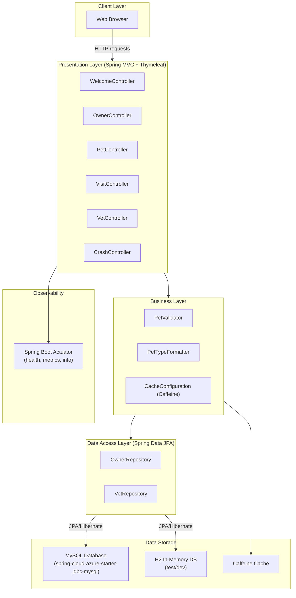

# Architecture Diagram

Spring PetClinic MySQL is a Spring Boot web application that manages pet clinic data using a MySQL backend, with Thymeleaf-based UI, Spring Data JPA for persistence, and Spring Cloud Azure for cloud-native MySQL connectivity.

## Application Architecture

