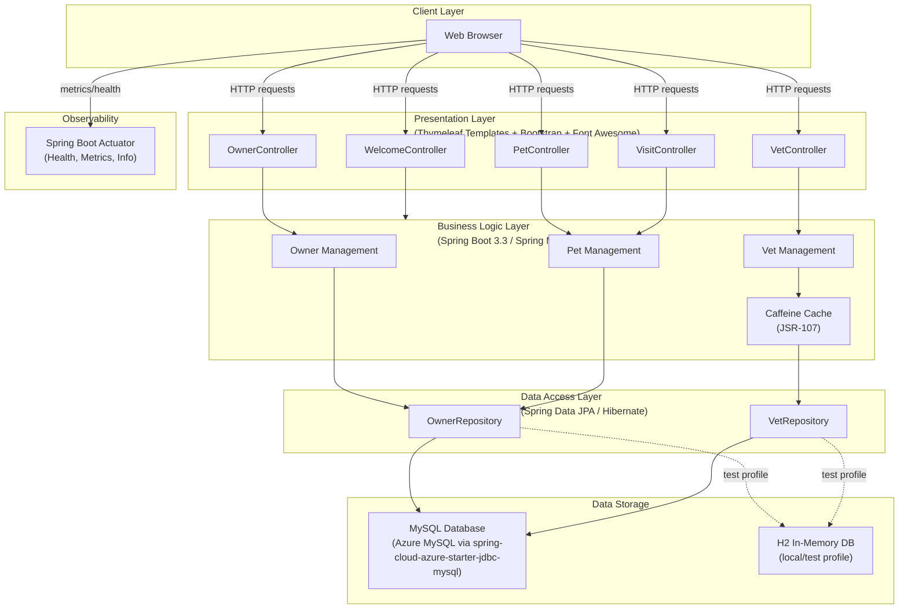

# Architecture Diagram

This diagram illustrates the high-level architecture of the Spring PetClinic MySQL application, showing the application layers, key frameworks, data storage, and external integrations.

## Application Architecture

