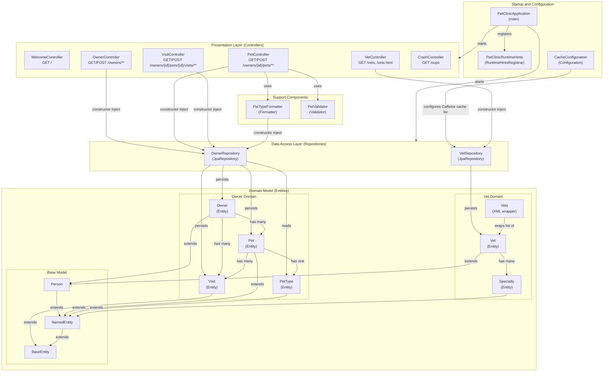

# Component Relationship Diagram

## Spring PetClinic MySQL - Component Relationships

## Component Inventory

| Component | Type | Package | Dependencies |
|-----------|------|---------|--------------|
| PetClinicApplication | Main | petclinic | - |
| PetClinicRuntimeHints | RuntimeHintsRegistrar | petclinic | - |
| CacheConfiguration | Configuration | system | VetRepository (via cache manager) |
| WelcomeController | Controller | system | - |
| CrashController | Controller | system | - |
| OwnerController | Controller | owner | OwnerRepository |
| PetController | Controller | owner | OwnerRepository, PetTypeFormatter, PetValidator |
| VisitController | Controller | owner | OwnerRepository |
| VetController | Controller | vet | VetRepository |
| OwnerRepository | Repository | owner | Owner, Pet, PetType, Visit (JPA entities) |
| VetRepository | Repository | vet | Vet, Specialty (JPA entities) |
| PetTypeFormatter | Formatter | owner | OwnerRepository |
| PetValidator | Validator | owner | - |
| Owner | Entity | owner | Pet, Visit |
| Pet | Entity | owner | PetType, Visit |
| PetType | Entity | owner | - |
| Visit | Entity | owner | - |
| Vet | Entity | vet | Specialty |
| Specialty | Entity | vet | - |
| Vets | XML Wrapper | vet | Vet |
| BaseEntity | Base Model | model | - |
| NamedEntity | Base Model | model | BaseEntity |
| Person | Base Model | model | NamedEntity |
