# Dependency Map

## Spring PetClinic MySQL - Dependency Map

```mermaid
graph TD
    App["spring-petclinic-mysql v3.3.0-SNAPSHOT"]

    subgraph BOM["Parent BOM"]
        Parent["spring-boot-starter-parent v3.3.2"]
    end

    subgraph Web["Web and Presentation"]
        SBWeb["spring-boot-starter-web"]
        SBThyme["spring-boot-starter-thymeleaf"]
        SBValid["spring-boot-starter-validation"]
        Bootstrap["bootstrap v5.3.3 (webjars)"]
        FontAwesome["font-awesome v4.7.0 (webjars)"]
    end

    subgraph DataAccess["Data Access and ORM"]
        SBJPA["spring-boot-starter-data-jpa"]
        JakartaBind["jakarta.xml.bind-api"]
    end

    subgraph Database["Database Drivers (runtime)"]
        H2["h2 (runtime)"]
        MySQLConn["mysql-connector-j (runtime)"]
        AzureJDBC["spring-cloud-azure-starter-jdbc-mysql v5.16.0"]
    end

    subgraph Caching["Caching"]
        SBCache["spring-boot-starter-cache"]
        JCache["javax.cache cache-api"]
        Caffeine["caffeine"]
    end

    subgraph Monitoring["Monitoring and Ops"]
        SBActuator["spring-boot-starter-actuator"]
    end

    subgraph Testing["Testing (test scope)"]
        SBTest["spring-boot-starter-test"]
        SBDevTools["spring-boot-devtools"]
        SBTestContainers["spring-boot-testcontainers"]
        SBDockerCompose["spring-boot-docker-compose"]
        TCJunit["testcontainers junit-jupiter"]
        TCMySQL["testcontainers mysql"]
    end

    App -->|inherits| Parent
    App --> SBWeb
    App --> SBThyme
    App --> SBValid
    App --> Bootstrap
    App --> FontAwesome
    App --> SBJPA
    App --> JakartaBind
    App --> H2
    App --> MySQLConn
    App --> AzureJDBC
    App --> SBCache
    App --> JCache
    App --> Caffeine
    App --> SBActuator
    App --> SBTest
    App --> SBDevTools
    App --> SBTestContainers
    App --> SBDockerCompose
    App --> TCJunit
    App --> TCMySQL

    SBCache -->|uses| JCache
    SBCache -->|uses| Caffeine
    AzureJDBC -->|wraps| MySQLConn
```

## Dependency Summary

| Category | Artifact | Version | Scope |
|----------|----------|---------|-------|
| **BOM** | spring-boot-starter-parent | 3.3.2 | parent |
| **Web** | spring-boot-starter-web | managed | compile |
| **Web** | spring-boot-starter-thymeleaf | managed | compile |
| **Web** | spring-boot-starter-validation | managed | compile |
| **Web** | bootstrap (webjars) | 5.3.3 | compile |
| **Web** | font-awesome (webjars) | 4.7.0 | compile |
| **Data Access** | spring-boot-starter-data-jpa | managed | compile |
| **Data Access** | jakarta.xml.bind-api | managed | compile |
| **Database** | h2 | managed | runtime |
| **Database** | mysql-connector-j | managed | runtime |
| **Database** | spring-cloud-azure-starter-jdbc-mysql | 5.16.0 | compile |
| **Caching** | spring-boot-starter-cache | managed | compile |
| **Caching** | javax.cache cache-api | managed | compile |
| **Caching** | caffeine | managed | compile |
| **Monitoring** | spring-boot-starter-actuator | managed | compile |
| **Testing** | spring-boot-starter-test | managed | test |
| **Testing** | spring-boot-devtools | managed | test |
| **Testing** | spring-boot-testcontainers | managed | test |
| **Testing** | spring-boot-docker-compose | managed | test |
| **Testing** | testcontainers junit-jupiter | managed | test |
| **Testing** | testcontainers mysql | managed | test |
