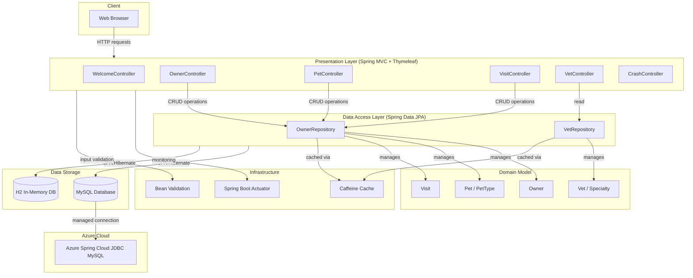

# Architecture Diagram

## Spring PetClinic MySQL - Application Architecture

## Technology Stack

| Layer | Technology |
|-------|-----------|
| Framework | Spring Boot 3.3.2 |
| Language | Java 17 |
| Web | Spring MVC, Thymeleaf |
| Data Access | Spring Data JPA, Hibernate |
| Database (prod) | MySQL (via Azure Spring Cloud JDBC 5.16.0) |
| Database (dev) | H2 In-Memory |
| Caching | Caffeine, javax.cache |
| Monitoring | Spring Boot Actuator |
| Frontend | Bootstrap 5.3.3, Font Awesome 4.7.0 (Webjars) |
| Validation | Jakarta Bean Validation |
| Build | Maven |
