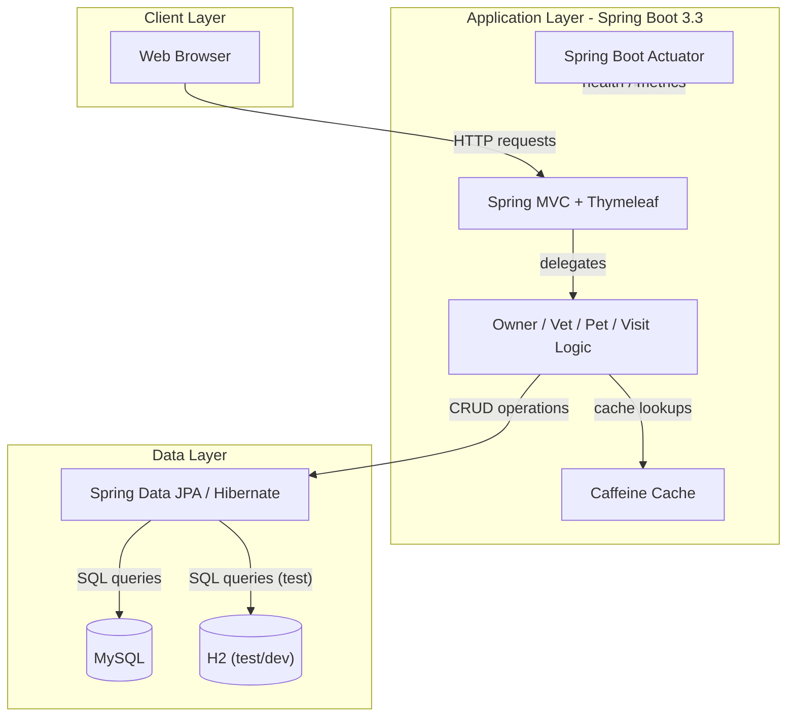
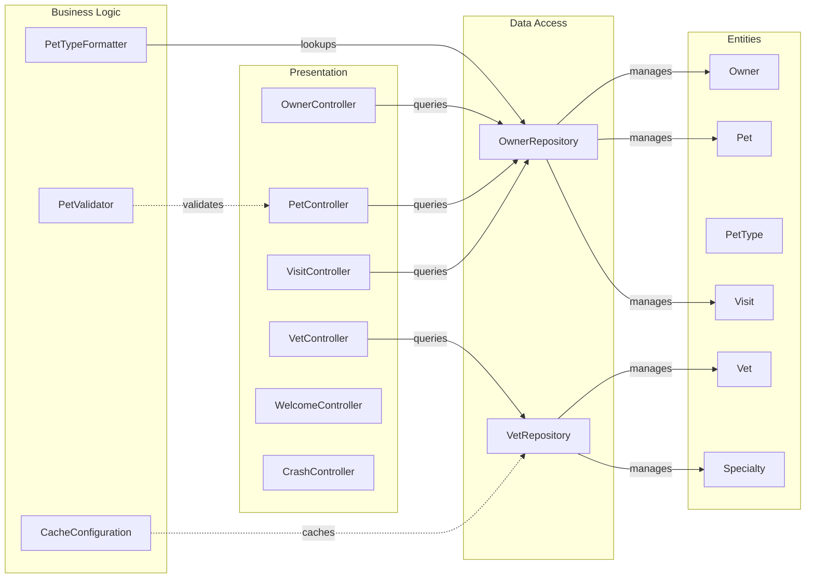

# Architecture Diagram

Spring PetClinic MySQL is a Spring Boot 3.3 web application using Thymeleaf for UI, Spring Data JPA for data access, and MySQL as its primary database, with Caffeine for in-memory caching.

## Application Architecture

## Component Relationships

