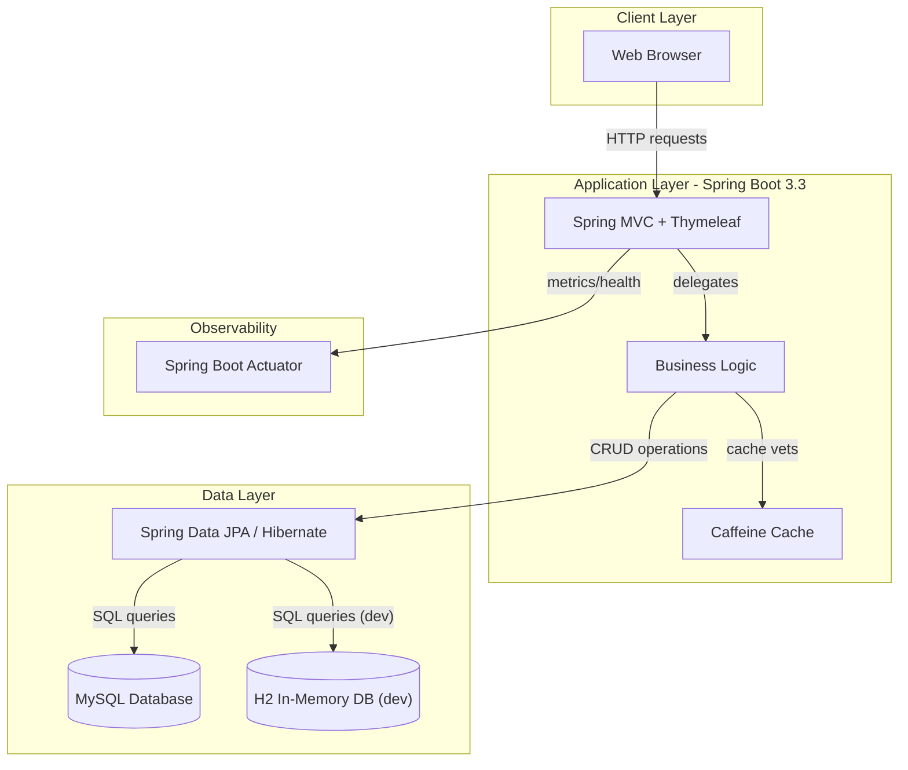
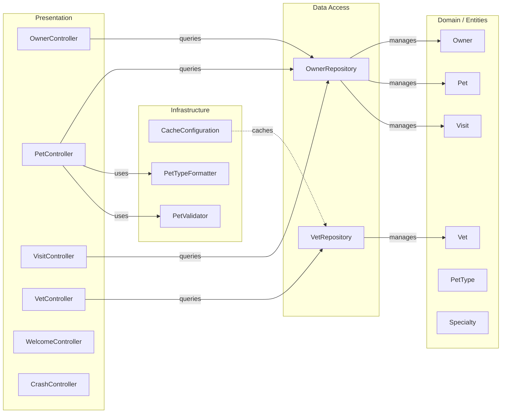

# Architecture Diagram

Spring PetClinic MySQL is a Spring Boot 3.3 web application using Thymeleaf for server-side rendering, Spring Data JPA for data access, and MySQL as the primary database, with Caffeine cache for vet data.

## Application Architecture

## Component Relationships

