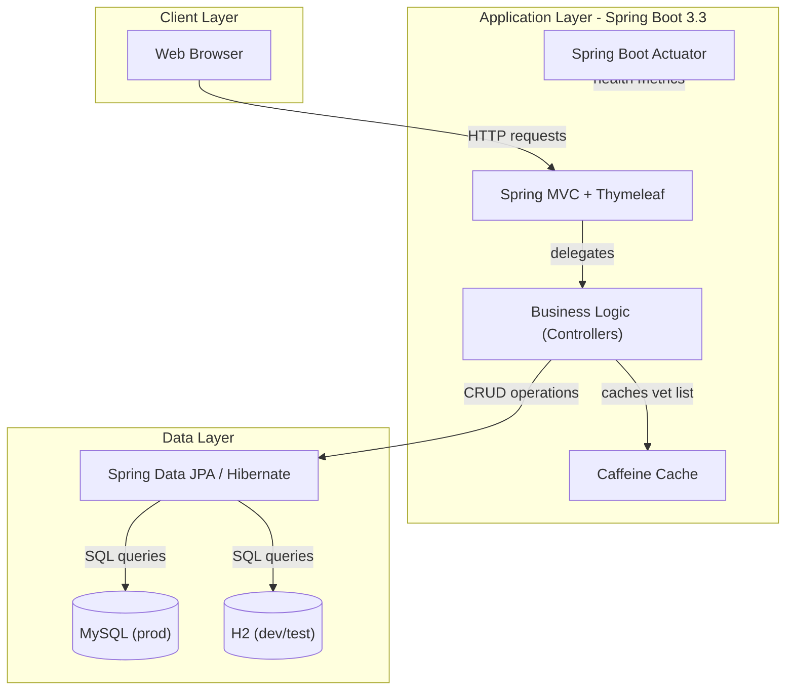
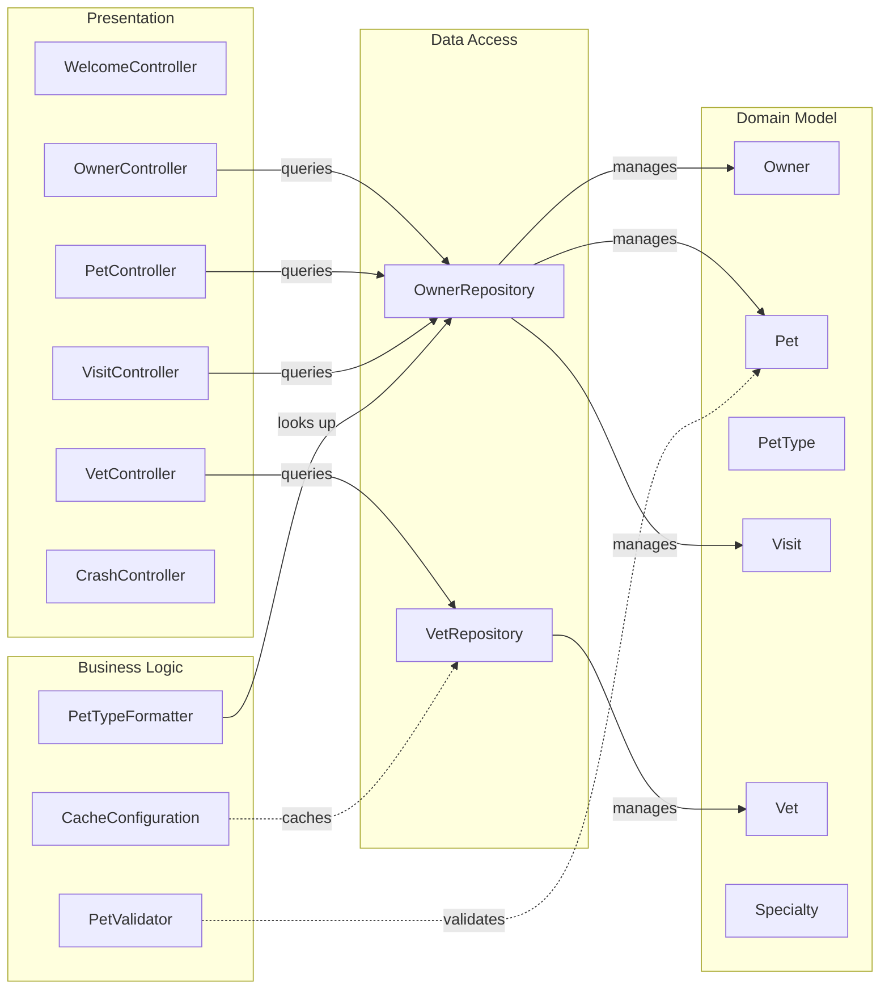

# Architecture Diagram

A Spring Boot 3.3 web application implementing a veterinary clinic management system with Thymeleaf UI, Spring MVC controllers, Spring Data JPA repositories, and a MySQL backend with H2 for development.

## Application Architecture

## Component Relationships

