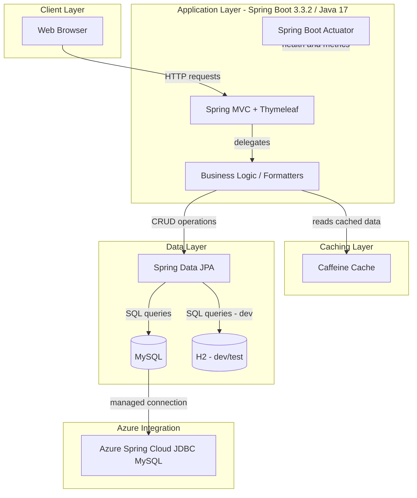
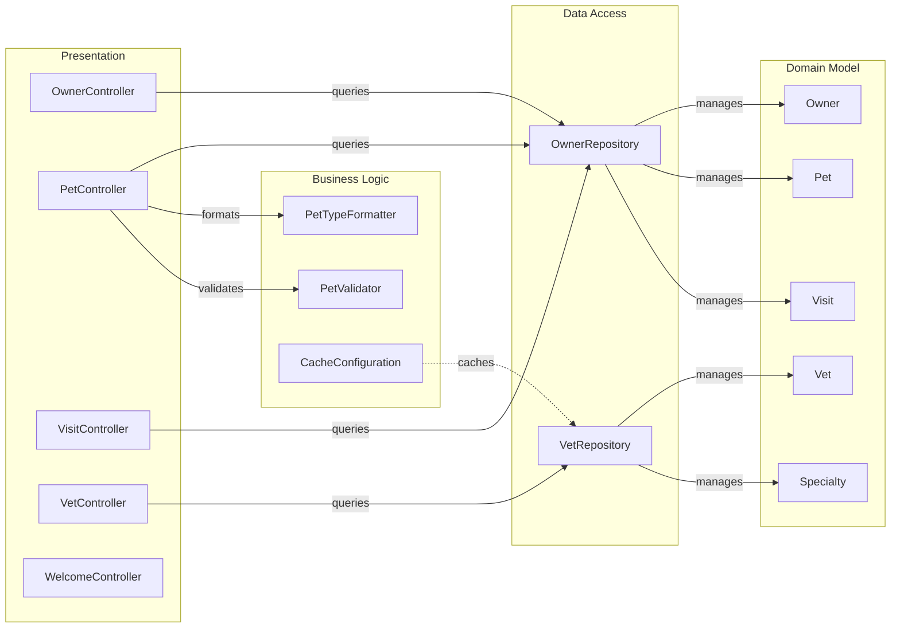

# Architecture Diagram

Spring PetClinic (MySQL) is a Spring Boot 3.3.2 web application using Spring MVC with Thymeleaf for the UI, Spring Data JPA for persistence with MySQL (via Azure Spring Cloud JDBC), and Caffeine for in-process caching.

## Application Architecture

## Component Relationships

