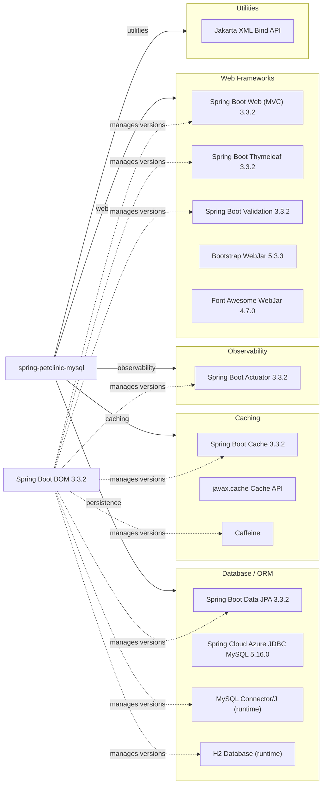

# Dependency Map

Spring PetClinic MySQL declares 15 external dependencies (excluding test scope) managed via the Spring Boot 3.3.2 parent BOM.

## Dependencies

```mermaid
flowchart LR
    App["spring-petclinic-mysql"]

    BOM["Spring Boot BOM 3.3.2"]

    subgraph Web["Web Frameworks"]
        SpringWeb["Spring Boot Web (MVC) 3.3.2"]
        Thymeleaf["Spring Boot Thymeleaf 3.3.2"]
        Validation["Spring Boot Validation 3.3.2"]
        Bootstrap["Bootstrap WebJar 5.3.3"]
        FontAwesome["Font Awesome WebJar 4.7.0"]
    end
    subgraph DB["Database / ORM"]
        DataJPA["Spring Boot Data JPA 3.3.2"]
        AzureMySQL["Spring Cloud Azure JDBC MySQL 5.16.0"]
        MySQLDriver["MySQL Connector/J (runtime)"]
        H2["H2 Database (runtime)"]
    end
    subgraph Cache["Caching"]
        SpringCache["Spring Boot Cache 3.3.2"]
        CacheAPI["javax.cache Cache API"]
        Caffeine["Caffeine"]
    end
    subgraph Obs["Observability"]
        Actuator["Spring Boot Actuator 3.3.2"]
    end
    subgraph Util["Utilities"]
        JakartaXmlBind["Jakarta XML Bind API"]
    end

    App -->|"web"| Web
    App -->|"persistence"| DB
    App -->|"caching"| Cache
    App -->|"observability"| Obs
    App -->|"utilities"| Util
    BOM -.->|"manages versions"| SpringWeb
    BOM -.->|"manages versions"| Thymeleaf
    BOM -.->|"manages versions"| Validation
    BOM -.->|"manages versions"| DataJPA
    BOM -.->|"manages versions"| SpringCache
    BOM -.->|"manages versions"| Actuator
    BOM -.->|"manages versions"| MySQLDriver
    BOM -.->|"manages versions"| H2
    BOM -.->|"manages versions"| Caffeine
```
