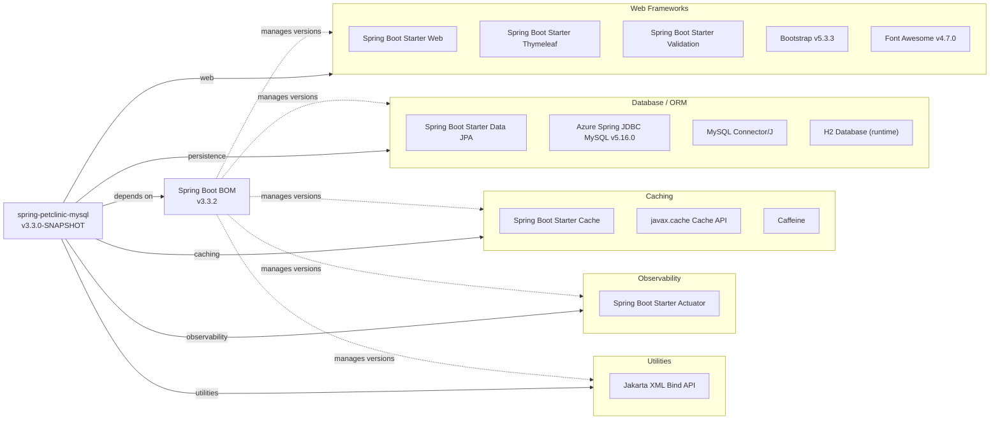

# Dependency Map

Spring PetClinic MySQL declares 13 compile/runtime external dependencies managed via Spring Boot 3.3.2 parent BOM.

## Dependencies

```mermaid
flowchart LR
    App["spring-petclinic-mysql\nv3.3.0-SNAPSHOT"]
    BOM["Spring Boot BOM\nv3.3.2"]

    subgraph Web["Web Frameworks"]
        StarterWeb["Spring Boot Starter Web"]
        StarterThymeleaf["Spring Boot Starter Thymeleaf"]
        StarterValidation["Spring Boot Starter Validation"]
        Bootstrap["Bootstrap v5.3.3"]
        FontAwesome["Font Awesome v4.7.0"]
    end
    subgraph DB["Database / ORM"]
        StarterJPA["Spring Boot Starter Data JPA"]
        AzureMySQL["Azure Spring JDBC MySQL v5.16.0"]
        MySQLDriver["MySQL Connector/J"]
        H2["H2 Database (runtime)"]
    end
    subgraph Cache["Caching"]
        StarterCache["Spring Boot Starter Cache"]
        CacheAPI["javax.cache Cache API"]
        Caffeine["Caffeine"]
    end
    subgraph Observability["Observability"]
        StarterActuator["Spring Boot Starter Actuator"]
    end
    subgraph Util["Utilities"]
        JakartaBind["Jakarta XML Bind API"]
    end

    BOM -.->|"manages versions"| Web
    BOM -.->|"manages versions"| DB
    BOM -.->|"manages versions"| Cache
    BOM -.->|"manages versions"| Observability
    BOM -.->|"manages versions"| Util
    App -->|"depends on"| BOM
    App -->|"web"| Web
    App -->|"persistence"| DB
    App -->|"caching"| Cache
    App -->|"observability"| Observability
    App -->|"utilities"| Util
```
