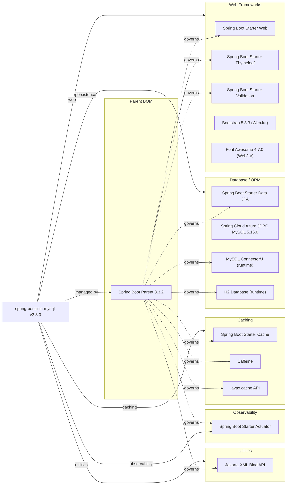

# Dependency Map

Spring PetClinic MySQL declares 13 non-test external dependencies managed via the Spring Boot 3.3.2 parent BOM plus the Spring Cloud Azure 5.16.0 starter.

## Dependencies

```mermaid
flowchart LR
    App["spring-petclinic-mysql v3.3.0"]

    subgraph BOM["Parent BOM"]
        SBParent["Spring Boot Parent 3.3.2"]
    end

    subgraph Web["Web Frameworks"]
        StarterWeb["Spring Boot Starter Web"]
        StarterThymeleaf["Spring Boot Starter Thymeleaf"]
        StarterValidation["Spring Boot Starter Validation"]
        Bootstrap["Bootstrap 5.3.3 (WebJar)"]
        FontAwesome["Font Awesome 4.7.0 (WebJar)"]
    end

    subgraph DB["Database / ORM"]
        StarterJPA["Spring Boot Starter Data JPA"]
        AzureMySQL["Spring Cloud Azure JDBC MySQL 5.16.0"]
        MySQLDriver["MySQL Connector/J (runtime)"]
        H2["H2 Database (runtime)"]
    end

    subgraph Cache["Caching"]
        StarterCache["Spring Boot Starter Cache"]
        Caffeine["Caffeine"]
        CacheAPI["javax.cache API"]
    end

    subgraph Observability["Observability"]
        Actuator["Spring Boot Starter Actuator"]
    end

    subgraph Util["Utilities"]
        JakartaXMLBind["Jakarta XML Bind API"]
    end

    App -.->|"managed by"| SBParent
    App -->|"web"| Web
    App -->|"persistence"| DB
    App -->|"caching"| Cache
    App -->|"observability"| Actuator
    App -->|"utilities"| Util
    SBParent -.->|"governs"| StarterWeb
    SBParent -.->|"governs"| StarterThymeleaf
    SBParent -.->|"governs"| StarterValidation
    SBParent -.->|"governs"| StarterJPA
    SBParent -.->|"governs"| MySQLDriver
    SBParent -.->|"governs"| H2
    SBParent -.->|"governs"| StarterCache
    SBParent -.->|"governs"| Caffeine
    SBParent -.->|"governs"| CacheAPI
    SBParent -.->|"governs"| Actuator
    SBParent -.->|"governs"| JakartaXMLBind
```
