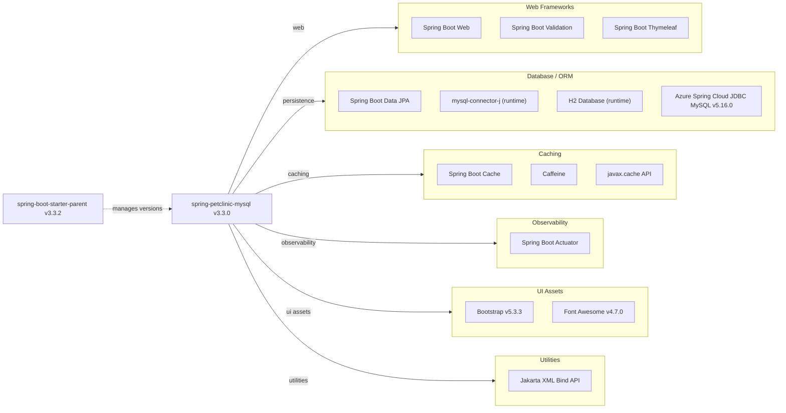

# Dependency Map

Spring PetClinic (MySQL) declares 13 production dependencies managed via Spring Boot 3.3.2 parent BOM, covering web, persistence, caching, observability, and UI layers.

## Dependencies

