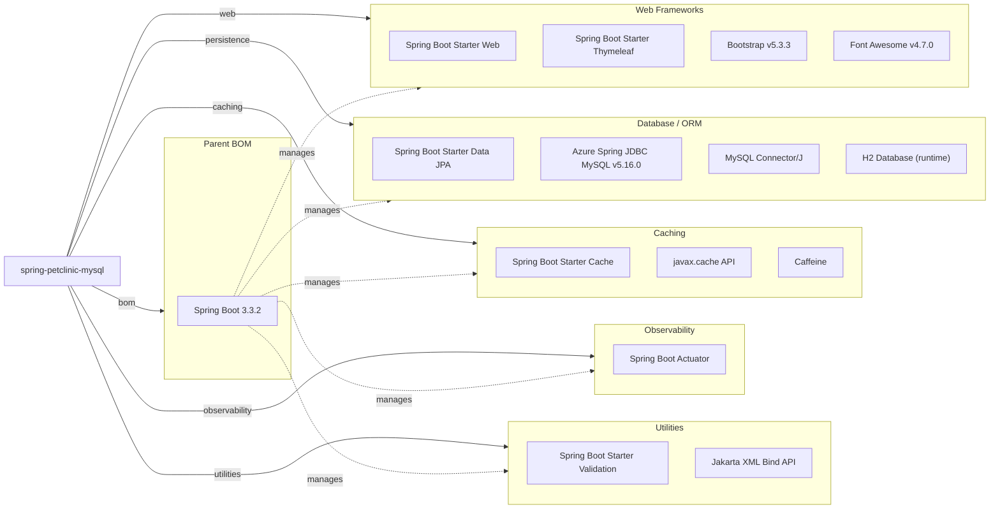

# Dependency Map

Spring PetClinic MySQL is a Spring Boot 3.3 application with 14 declared non-test external dependencies spanning web, persistence, caching, observability, and utility categories.

## Dependencies

