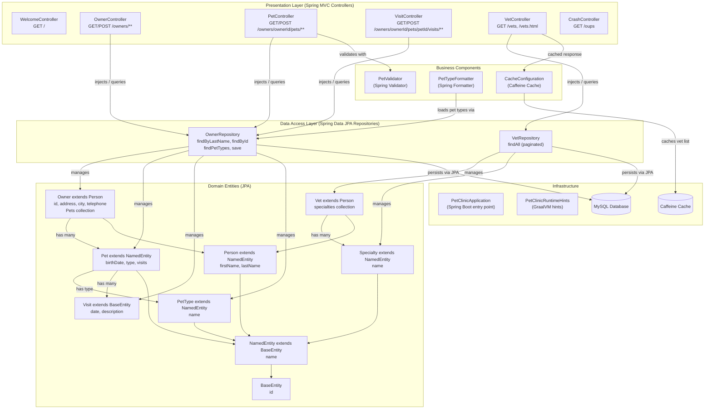

# Component Relationship Diagram

Spring PetClinic MySQL internal component structure and interactions, showing how controllers, repositories, entities, and supporting components are related.

## Component Relationships

