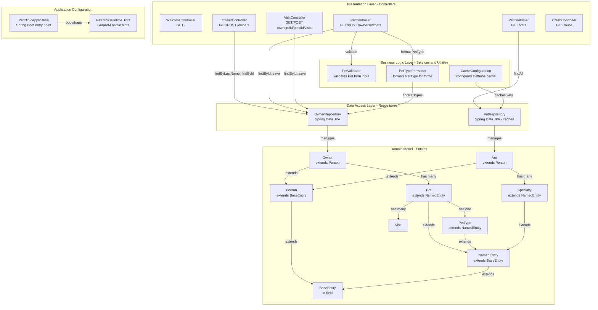

# Component Relationship Diagram

This diagram shows the internal component structure and interactions within the Spring PetClinic MySQL application, organized by architectural layer.

## Component Relationships

