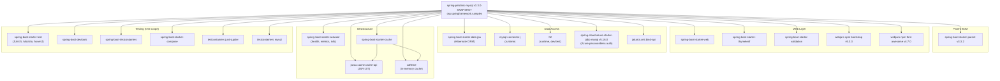

# Dependency Map

Spring PetClinic MySQL dependency structure, showing direct and transitive dependencies grouped by functional category from the Maven build file.

## Project Dependencies

```mermaid
flowchart TD
    App["spring-petclinic-mysql v3.3.0-SNAPSHOT\norg.springframework.samples"]

    subgraph Parent["Parent BOM"]
        SpringBootParent["spring-boot-starter-parent v3.3.2"]
    end

    subgraph Web["Web Layer"]
        StarterWeb["spring-boot-starter-web"]
        StarterThymeleaf["spring-boot-starter-thymeleaf"]
        StarterValidation["spring-boot-starter-validation"]
        Bootstrap["webjars npm bootstrap v5.3.3"]
        FontAwesome["webjars npm font-awesome v4.7.0"]
    end

    subgraph DataAccess["Data Access"]
        StarterJpa["spring-boot-starter-data-jpa\n(Hibernate ORM)"]
        MysqlConnector["mysql-connector-j\n(runtime)"]
        H2["h2\n(runtime, dev/test)"]
        AzureMySQL["spring-cloud-azure-starter-jdbc-mysql v5.16.0\n(Azure passwordless auth)"]
        JakartaBind["jakarta.xml.bind-api"]
    end

    subgraph Infrastructure["Infrastructure"]
        StarterActuator["spring-boot-starter-actuator\n(health, metrics, info)"]
        StarterCache["spring-boot-starter-cache"]
        CacheAPI["javax.cache cache-api\n(JSR-107)"]
        Caffeine["caffeine\n(in-memory cache)"]
    end

    subgraph Testing["Testing (test scope)"]
        StarterTest["spring-boot-starter-test\n(JUnit 5, Mockito, AssertJ)"]
        DevTools["spring-boot-devtools"]
        TestContainers["spring-boot-testcontainers"]
        DockerCompose["spring-boot-docker-compose"]
        TCJunit["testcontainers junit-jupiter"]
        TCMySQL["testcontainers mysql"]
    end

    App --> SpringBootParent
    App --> StarterWeb
    App --> StarterThymeleaf
    App --> StarterValidation
    App --> Bootstrap
    App --> FontAwesome
    App --> StarterJpa
    App --> MysqlConnector
    App --> H2
    App --> AzureMySQL
    App --> JakartaBind
    App --> StarterActuator
    App --> StarterCache
    App --> CacheAPI
    App --> Caffeine
    App --> StarterTest
    App --> DevTools
    App --> TestContainers
    App --> DockerCompose
    App --> TCJunit
    App --> TCMySQL

    StarterCache --> CacheAPI
    StarterCache --> Caffeine
```
