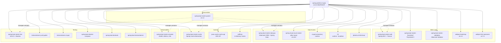

# Dependency Map

This diagram shows the dependency structure of the Spring PetClinic MySQL application, grouped by functional category.

## Project Dependencies

```mermaid
flowchart TD
    App["spring-petclinic-mysql\nv3.3.0-SNAPSHOT"]

    subgraph Parent["Parent BOM"]
        SpringBoot["spring-boot-starter-parent\nv3.3.2"]
    end

    subgraph Web["Web Layer"]
        StarterWeb["spring-boot-starter-web\nSpring MVC + Tomcat"]
        StarterThymeleaf["spring-boot-starter-thymeleaf\nThymeleaf 3"]
        StarterValidation["spring-boot-starter-validation\nHibernate Validator"]
        Bootstrap["webjars-bootstrap\nv5.3.3"]
        FontAwesome["webjars-font-awesome\nv4.7.0"]
    end

    subgraph DataAccess["Data Access"]
        StarterJPA["spring-boot-starter-data-jpa\nHibernate ORM + Spring Data"]
        AzureMySQL["spring-cloud-azure-starter-jdbc-mysql\nv5.16.0"]
        MySQLConnector["mysql-connector-j\nruntime"]
        H2["h2\nruntime - local/test"]
        JakartaBind["jakarta.xml.bind-api"]
    end

    subgraph Caching["Caching"]
        StarterCache["spring-boot-starter-cache\nSpring Cache Abstraction"]
        CacheAPI["javax.cache cache-api\nJSR-107"]
        Caffeine["caffeine\nIn-Memory Cache"]
    end

    subgraph Observability["Observability"]
        StarterActuator["spring-boot-starter-actuator\nHealth, Metrics, Info"]
    end

    subgraph Testing["Testing"]
        StarterTest["spring-boot-starter-test\nJUnit 5 + Mockito"]
        Testcontainers["testcontainers junit-jupiter"]
        TestcontainersMySQL["testcontainers mysql"]
        SpringDockerCompose["spring-boot-docker-compose"]
        SpringDevtools["spring-boot-devtools"]
        SpringTestcontainers["spring-boot-testcontainers"]
    end

    App --> SpringBoot

    App --> StarterWeb
    App --> StarterThymeleaf
    App --> StarterValidation
    App --> Bootstrap
    App --> FontAwesome

    App --> StarterJPA
    App --> AzureMySQL
    App --> MySQLConnector
    App --> H2
    App --> JakartaBind

    App --> StarterCache
    App --> CacheAPI
    App --> Caffeine

    App --> StarterActuator

    App --> StarterTest
    App --> Testcontainers
    App --> TestcontainersMySQL
    App --> SpringDockerCompose
    App --> SpringDevtools
    App --> SpringTestcontainers

    SpringBoot -.->|manages versions| StarterWeb
    SpringBoot -.->|manages versions| StarterJPA
    SpringBoot -.->|manages versions| StarterCache
    SpringBoot -.->|manages versions| StarterActuator
    SpringBoot -.->|manages versions| StarterTest
```
